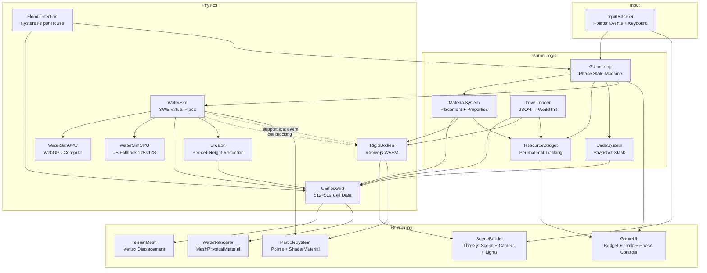
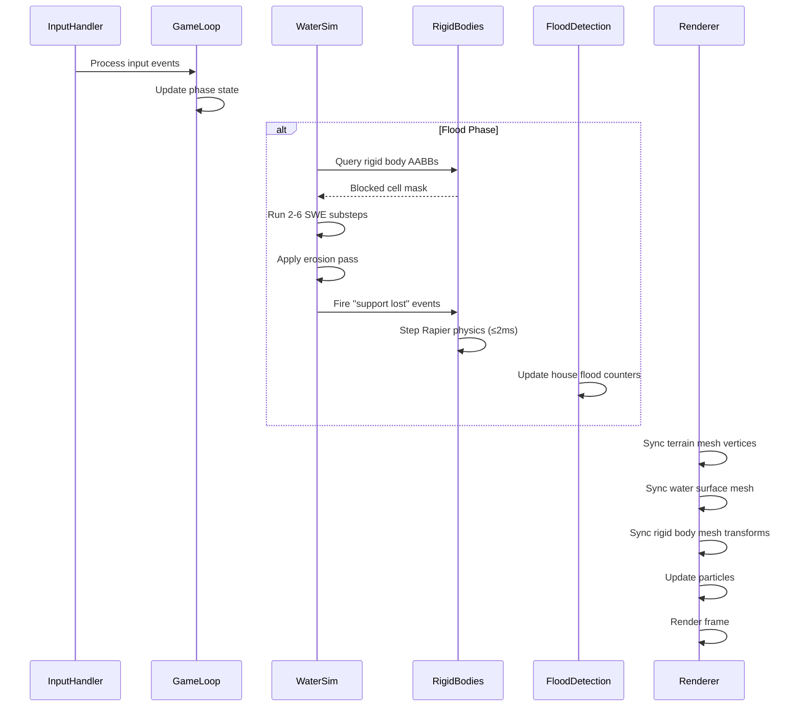

# Design Document — Dam-Orama

## Overview

Dam-Orama is a browser-based physics puzzle game where the player builds flood defences in a rotatable 3D diorama to protect houses from rising water. The game runs on a two-layer hybrid physics architecture: a GPU-accelerated shallow water simulation (SWE via Virtual Pipes) for fluid behaviour, and Rapier.js for rigid body structural physics. These layers are coupled at the boundary where water interacts with placed blocks.

The rendering stack is Three.js with `WebGPURenderer` (falling back to `WebGLRenderer`). The water simulation runs on WebGPU compute shaders at 512×512 resolution, with a CPU fallback at 128×128 for older browsers. All input is unified through the Pointer Events API, supporting touch-first interaction with desktop keyboard/mouse as secondary.

The game loop is a three-phase state machine: Construction (build defences, no water), Flood (water released, observe), Resolution (win/loss evaluation). Each level is defined as a JSON file specifying terrain, water sources, houses, resource budgets, and flood parameters.

### Key Design Decisions

- **Grid unification**: The terrain heightmap and water simulation share a single 512×512 grid. No separate grids, no mapping. Each cell stores terrain height, water depth, material type, and permeability.
- **Two-layer physics**: SWE owns all fluid/erosion behaviour. Rapier owns all rigid body behaviour. They communicate through cell blocking and "support lost" events.
- **Seepage deferred**: Per-cell permeability is stored but only modulates erosion rate in Level 1. Subsurface Darcy flow is a future feature.
- **Touch-first**: All interactions designed for touch, with desktop keyboard/mouse as secondary.
- **Hand-crafted levels**: Each level is a unique JSON-defined diorama, not procedurally generated.

## Architecture

The system is organised into five major subsystems that communicate through well-defined interfaces.

### Subsystem Responsibilities

**Physics Layer** — Owns all simulation state. The `UnifiedGrid` is the single source of truth for terrain and water. `WaterSim` is a facade that delegates to either `WaterSimGPU` or `WaterSimCPU` based on browser capability. `RigidBodies` wraps Rapier.js. `FloodDetection` reads water depth from the grid and applies hysteresis logic. `Erosion` modifies terrain height based on flow velocity and material properties.

**Game Logic Layer** — Owns game state and rules. `GameLoop` manages phase transitions. `MaterialSystem` defines material properties and handles placement logic (terrain sculpt vs rigid body creation). `ResourceBudget` tracks per-material unit counts. `UndoSystem` captures and restores grid snapshots. `LevelLoader` parses JSON and initialises all subsystems.

**Input Layer** — `InputHandler` translates Pointer Events and keyboard events into game actions (sculpt, place, camera orbit, zoom, undo). It distinguishes touch gestures (1-finger drag, 2-finger pinch/rotate) from mouse/keyboard input.

**Rendering Layer** — `SceneBuilder` manages the Three.js scene, camera, and lighting. `TerrainMesh` syncs vertex positions from the grid. `WaterRenderer` renders the water surface plane. `ParticleSystem` emits cosmetic particles. `GameUI` renders the HUD (budget counters, undo button, phase controls).

### Data Flow Per Frame

